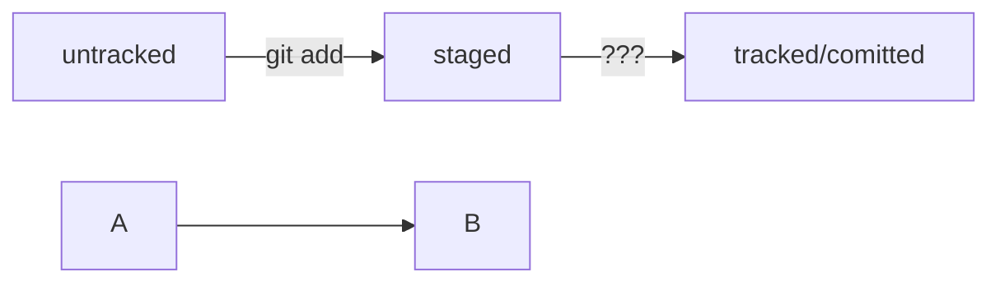

# Минимум по Git — Global Information Tracker

**VCS (Version Control System) — система контроля версий**  
__SCM (Source Control Management) — система управления исходным кодом__

## Работа с командной строкой
Полезные команды:

текущая директория — pwd  
менять директории командой  
cd ~  
cd /c/  
cd ..  
выводить содержимое директорий  
ls  
ls -a(показывать скрытые файлы)  

Создание файлов и директорий — touch, mkdir  
mkdir -p (--parents)  
Копирование файлов — cp  
Перемещение файлов и папок — mv  
Чтение файлов — cat  
Удаление файлов и папок — rm, rmdir, rm -r(--recursive) 
 
&& — сразу несколько команд  

Tab — автозаполнение  

## Начало работы с Git

git version

git config --global user.name "..."

git config --global user.email ..@...

git config --list


## Работа с репозиторием

git init

если отменить, то rm -rf .git # удалили подпапку .git

Проверить статус, или состояние, репозитория — git status

Добавление файлов к репозиторию  
git add  
git add --all  
git add . # добавить всю текущую папку  

Выполнить коммит — git commit

git commit -m 'Мой первый коммит!' 

Просмотреть историю коммитов — git log  

Привязать удалённый репозиторий к локальному — git remote add

```
$ cd ~/dev/first-project
$ git remote add origin git@github.com:%ИМЯ_АККАУНТА%/first-project.git
```

Убедиться, что репозитории связаны, — git remote -v

Отправить изменения на удалённый репозиторий — git push

git push -u origin main

В дальнейшем  флаг -u можно опустить и писать просто git push.


## HEAD -- это голова!

Файл HEAD — один из служебных файлов папки .git, в котором записана ссылка (или ссылка на ссылку) на последний коммит. 
Также HEAD — синоним хеша последнего коммита — его можно передавать командам Git в качестве параметра.

## О статусах и жизненном цикле файлов

<тут пустая строка!>


<и тут пустая строка!> 
